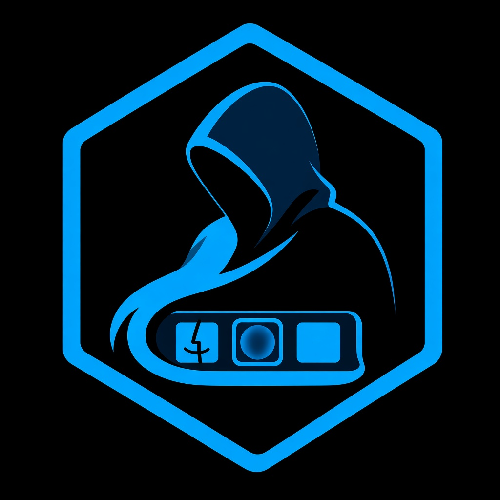

# RDock

Windows 上的類 macOS 風格 Dock（.NET 8 WPF）。



魚眼放大、自動隱藏、多螢幕停靠、拖放釘選、圖示快取。

## 需求

- Windows 10 / 11
- 自行編譯需 [.NET 8 SDK](https://dotnet.microsoft.com/download/dotnet/8.0)

## 建置

```bash
dotnet build -c Release
dotnet run -c Release --project RDock.csproj
```

## 發佈

```powershell
.\scripts\publish.ps1
```

單檔：`publish\single\RDock.exe`  
安裝包：用 [Inno Setup](https://jrsoftware.org/isinfo.php) 編譯 `installer\RDock.iss`

改版本時同步改 `RDock.csproj` 與 `installer\RDock.iss`。

## 授權

[MIT License](LICENSE)
